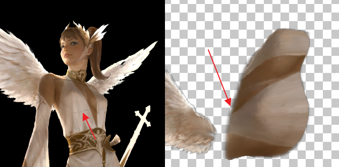
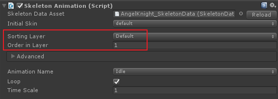

# TextureCompression


## Spine with Alpha-Mask

Usually an atlas images which are exported from spine editor have large file size to run on mobile device. An image size of 1024x1024 with RGBA32 takes 4M.

As mentioned on [this post](https://github.com/keijiro/unity-alphamask), you can also dramatically recude [Spine](https://github.com/EsotericSoftware/spine-runtimes)'s atlas image size up to 1/4 compared with RGBA32 format.

So it takes less loading time and makes a user feel the game runs smoothly.

But there are a few issues you should take care.

### Edge problem

A seam (or outline) can be found if the edge of a sprite image in the atlas image has translucent outline.

<p align="center">
  
</p>

> Note that the left side image is  spine image applied alpha-masked shader and the right side image is spine atlas image

It is hard to remove that seam with programmatic way. So modify that outlines found in the atlas image  not to have too much translucent with any image processing tool such as Photoshop. You will get better output.


### Order in Layer

You may also need to modify original shader code which can be found on [here](https://github.com/keijiro/unity-alphamask/blob/master/Assets/SpriteWithMask.shader) to support correct sorting order of the spine image when it is rendered on run time.

<p align="center">
  
</p>

To do sort of layers it just needs to add _"Transparent"_ value to _"Queue"_ key within Tags.

``` cpp
Shader "Custom/SpriteWithMask"
{
	Properties {
		_MainTex ("Base", 2D) = "white" {}
		_MaskTex ("Mask", 2D) = "white" {}
		_Color ("Color", Color) = (0.5, 0.5, 0.5, 0.5)
	}
	SubShader {
            // Add 'Transparent' value to "Queue" key
			Tags{ "Queue" = "Transparent" "IgnoreProjector" = "True" "RenderType" = "Transparent" }
			LOD 100

			Fog{ Mode Off }
			Cull Off
			ZWrite Off
			Blend SrcAlpha OneMinusSrcAlpha

		Pass {
			CGPROGRAM
```

> You don't need to apply "Spine/Skeleton", a deafult shader of spine runtime. Any 2D supported sprite  shader may work fine with spine's skeleton animation.

## Conclusion

There also other texture compression techniques which reduce bpp of the image.

* [ChromaPak](https://github.com/keijiro/ChromaPack)
* [YCCA Subsampling for Unity](https://github.com/n-yoda/unity-ycca-subsampling#ycca-subsampling-for-unity) - Most same as ChromaPak but supports alpha.

The differences of alpha-masked shader compared with other compressions is that it is mobile friendly(ETC for Android and PVRTC for iOS) and has better look for a character image normally has various range of pixels consist of the  image. Thus it is simple!


(C) 2016 Kim Hyoun Woo
